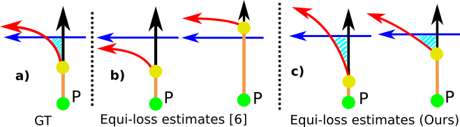
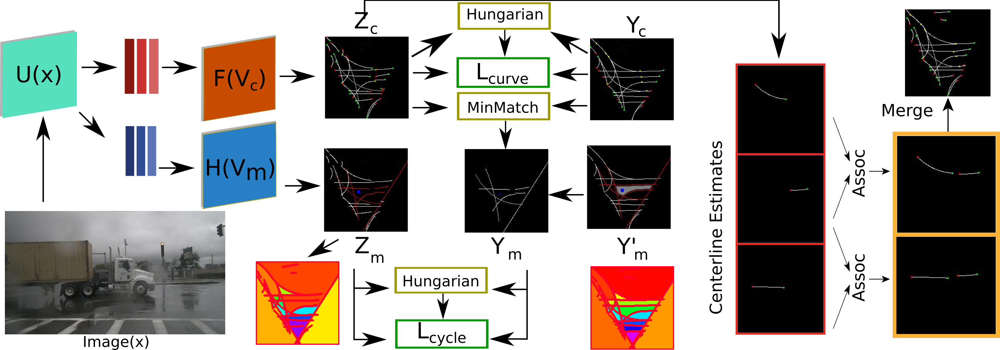

# Official code for "Topology Preserving Local Road Network Estimation from Single Onboard Camera Image" (CVPR 2022)

[Link to paper](https://arxiv.org/pdf/2112.10155.pdf)

## Idea

How would you give directions to a driver? One of the most intuitive ways is by stating turns, instead of distances. For example, taking **the third right turn** is more intuitive and robust than going **straight for 100 meters and turn right**. This observation motivates us to model road networks using the involved lanes and their intersections. 
Consider the example given in the figure. All 4 estimates (sub-figures **(b)** and **(c)**) have the same underlying directed graph. Now, consider a car moving from the green point P upwards in the figure, which needs to take the first left turn. In the two estimates of **(b)**, the first left leads to different lanes (red and blue, respectively). Moreover, the first left in righthandside of **(b)** is not even a legal turn. Our proposed method is trained to preserve the topology of the road network. In **(c)**, the first left turn is always the red curve. This is achieved by preserving the **Minimal-Cycles**. The cyan shaded region that exists in true lane graph, is preserved in our method. We show that, preserving these regions makes sure that the topology is preserved. 

## Implementation

The overall method reconstructs the true minimal cycles in terms of the estiamted centerlines and uses these reconstructed minimal cycles as a supervision. This teaches the network the concept of closed cycles. Combined with the centerline (Bezier curve control points) supervision, this encourages topology preserving.

We provide support for Nuscenes and Argoverse datasets. 

## Steps
0. Make sure you have installed Nuscenes and/or Argoverse devkits and datasets installed
1. Set the paths in the relevant config .yml file in the configs folder
2. Run the make_labels.py file for the dataset you want to use (Identical to [STSU](https://github.com/ybarancan/STSU) ) 
3. Download the exracted Minimal-Cycles from the link below or extract them with poly_gt_saver.py. Noe that extraction of MCs take a lot of time. Thus, set the interval_start and interval_end options. The MCs for the scenes in the provided interval will be extracted and saved as npy file.
4. You can use train_tr_nusc.py/train_tr_argo.py for training the transformer based model or train_prnn_nusc.py/train_prnn_argo.py to train the Polygon-RNN based model 
5. We recommend using the pretrained STSU model to warm start
6. Validator files can be used for testing. The link to trained models are given below.

## Trained Models

Nuscenes trained Polygon-RNN based model is at:  https://data.vision.ee.ethz.ch/cany/TPLR/ckpts/PRNN_MC_Nusc.pth

Nuscenes trained Transformer based model is at:  https://data.vision.ee.ethz.ch/cany/TPLR/ckpts/TR_MC_Nusc.pth

Argoverse trained Polygon-RNN based model is at:  https://data.vision.ee.ethz.ch/cany/TPLR/ckpts/PRNN_MC_Argo.pth

Argoverse trained Transformer based model is at:  https://data.vision.ee.ethz.ch/cany/TPLR/ckpts/TR_MC_Argo.pth

## Extracted Minimal-Cycles

Nuscenes : https://data.vision.ee.ethz.ch/cany/TPLR/poly-dicts/nusc-polygon-dicts.zip

Argoverse : https://data.vision.ee.ethz.ch/cany/TPLR/poly-dicts/argo-polygon-dicts.zip

## Metrics

The implementation of the metrics can be found in src/utils/confusion.py.
Please refer to the paper for explanations on the metrics.

### Additional Links
- STSU: https://github.com/ybarancan/STSU
- Polygon-RNN: https://github.com/fidler-lab/polyrnn-pp
- DETR: https://github.com/facebookresearch/detr
- PINET: https://github.com/koyeongmin/PINet_new

